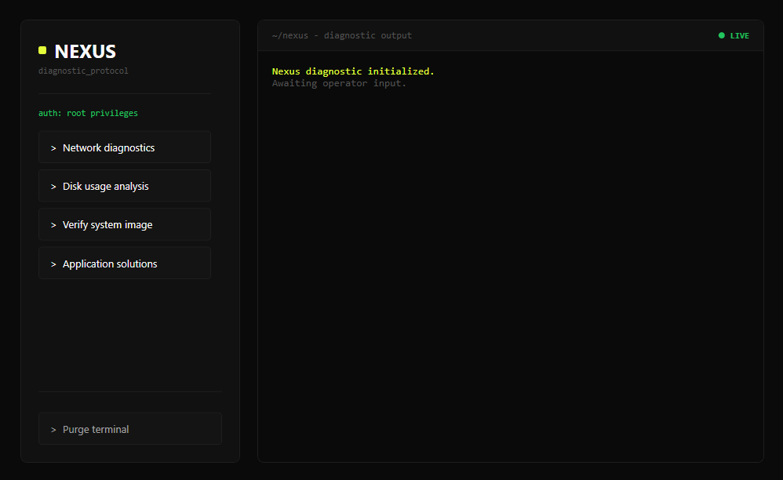

<p align="center">
  
</p>

<h1 align="center">NEXUS Diagnostic Tool</h1>

## Overview

NEXUS is a Windows diagnostic and repair tool designed to automate common troubleshooting tasks performed by IT support technicians.

After more than 3 years working in technical support, I created this project to reduce the time spent diagnosing recurring issues and to provide a faster, more consistent support workflow.

## Features

### Network Diagnostics
- DNS cache flush
- IP renewal
- Connectivity checks
- Network adapter diagnostics

### Disk Diagnostics
- Disk health verification
- File system integrity checks
- Storage usage analysis

### System Image Diagnostics
- Windows image verification
- DISM health checks
- System repair operations

### Application Diagnostics
- Microsoft Office troubleshooting
- Common application repair procedures

## Installation

Clone the repository:

```bash
git clone https://github.com/unaimedina/Nexus.git
cd Nexus
```

## Usage

Run the application with PowerShell:

```powershell
powershell -ExecutionPolicy Bypass -File .\HelpdeskGUI.ps1
```

## Requirements

- Windows 10 / Windows 11
- PowerShell 5.1 or later
- Administrator privileges (recommended)

## Screenshots



## Next features
- [ ] Event Viewer analysis
- [ ] Windows Update troubleshooting

## License

This project is licensed under the MIT License.